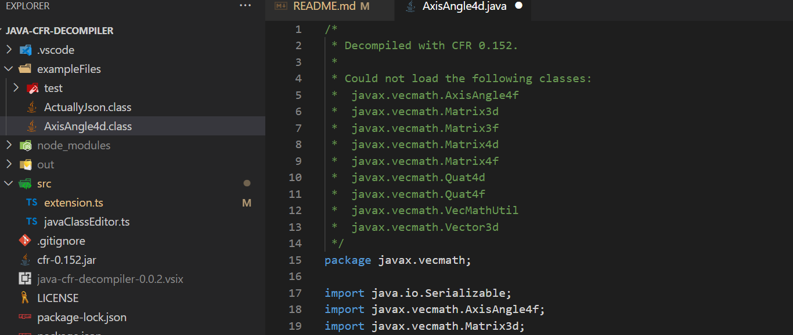
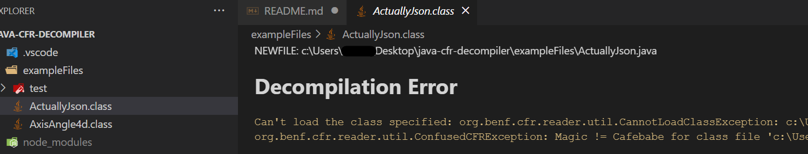
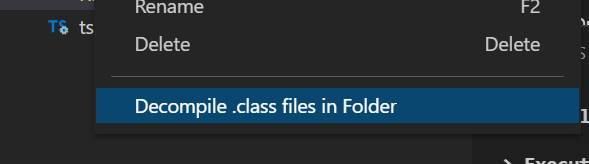
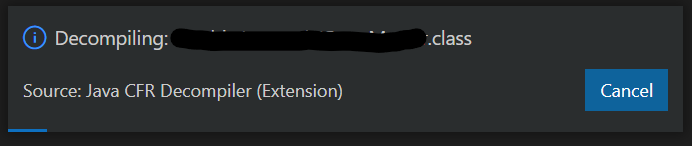

# Java CFR Decompiler

Implements `vscode.CustomReadonlyEditorProvider` to enable strightforward decompilation of Java `.class` files into `.java` files using [CFR 0.152](https://www.benf.org/other/cfr/)

## Decompiling a single `.class` file

Open a `.class` file from the Explorer side bar, see decompiled `.java` file instead. It's that simple.  
The editor is set up ready to be saved as a `.java` file.

If there's a decompilation error it will show up as the contents of the `.class` file.

## Decompiling a folder with `.class` files

Right click on a folder in the Explorer side bar, at the bottom of the context menu there's an option to decompile `.class` files in the folder.

Running that command will create new `.java` files next to each `.class` file. The progress is reported by a bar, and the process can be cancelled.

## Building and debugging

- Open this workspace in VS Code 1.46+
- `npm install`
- `npm run watch` or `npm run compile`
- `F5` to start debugging

Example files are in the `exampleFiles` directory.

`vsce package` to create `.vsix` for distribution